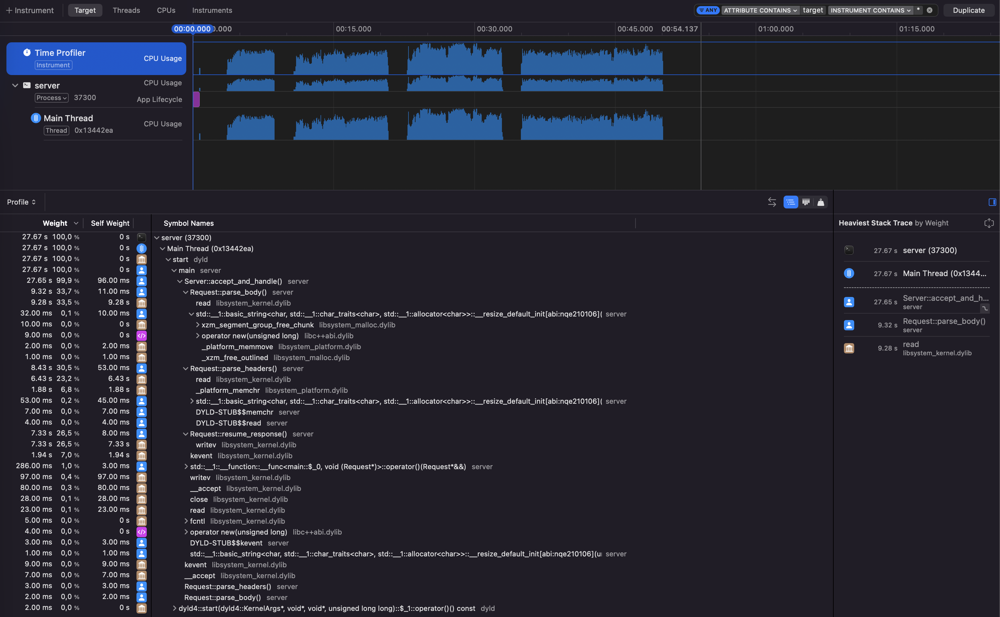

# cpp web server (optimized)

This is an example of how to go from a totally unoptimized c++23 web server to a highly optimized version.

I mainly developed this as a learning project on how to optimize c++ code interating with sockets.

**You can watch the full architectural breakdown on YouTube:**
* [Part 1: Optimizing a blocking server to 9,000 req/sec](https://youtu.be/dCwylDrxowQ)
* [Part 2: Rewriting a C++ Web Server From 9,000 to 58,000 Req/Sec](https://youtu.be/66FlfZYIitk)

I'll present each version chronologically, starting from the intentionally naive implementation and ending with the most optimized version. For each step, I'll explain what changed, why it matters, and how it affected performance.

For compilation and (quick) testing of each version I used:
```sh
# Terminal 1 (Server)
dos2unix ./scripts/start_server.sh
chmod +x ./scripts/start_server.sh
./scripts/start_server.sh

# Terminal 2 (Stress Testing)
dos2unix ./scripts/stress_test.sh
chmod +x ./scripts/stress_test.sh
./scripts/stress_test.sh
```

Initial optimizations are significant enough that we don't need to measure it using professional tooling.

Final version of the code can be found at master, all of the other versions are refered to by their appropriate git tag.

## Table of Contents

- [1. Naive Baseline](#1-naive-baseline)
- [2. Parsing and Syscall Optimizations](#2-parsing-and-syscall-optimizations)
- [3. Data Layout and I/O Micro-Optimizations](#3-data-layout-and-io-micro-optimizations)
- [4. Blocking Multithreaded Server](#4-blocking-multithreaded-server)
- [5. Event-Driven Non-Blocking Architecture](#5-event-driven-non-blocking-architecture)
- [6. Kqueue Event Loop Hot Path Optimizations](#6-kqueue-event-loop-hot-path-optimizations)
- [7. Multithreaded Kqueue Workers](#7-multithreaded-kqueue-workers)
- [8. Allocator and Profile-Guided Optimizations](#8-allocator-and-profile-guided-optimizations)

## 1. Naive Baseline
I tried to write a version with as many beginner mistakes as possible. It can be found at commit `072df00e03af5c9978e642f355cda08153a987a0`.

TLDR; 
- It reads the HTTP Request Line byte-by-byte (one `read` syscall per char).
- It uses `sscanf` to parse the request line (forces unnecessary memory copies).
- It pauses reading halfway to parse the request line, then starts a new read loop for the headers (ruins OS network buffering).
- It builds the outbound response using `+=` to concatenate everything. This thrashes the heap and doubles memory usage (serving a 10MB file takes 20MB of RAM).
- It double-copies the request body (reads into a temporary `malloc` buffer, then copies it into a `std::string`).
- It sends the response byte-by-byte (one `send` syscall per char, completely tanking throughput).
- It parses headers using unsafe, raw C pointer math (`strstr`, `strchr`).
- It allocates a brand new `std::string` just to pass the Content-Length view to `atoi()`.

### Results:
```sh
--- Warm-up ---
Running 5s test @ http://localhost:8888/
  8 threads and 1000 connections
  Thread Stats   Avg      Stdev     Max   +/- Stdev
    Latency    72.11ms    5.29ms  76.25ms   98.58%
    Req/Sec   221.79     47.80   330.00     66.00%
  8862 requests in 5.08s, 0.90MB read
Requests/sec:   1743.08
Transfer/sec:    180.45KB
Waiting 2 seconds for sockets to clear...

--- Baseline ---
Running 10s test @ http://localhost:8888/
  8 threads and 10000 connections
  Thread Stats   Avg      Stdev     Max   +/- Stdev
    Latency   100.85ms   47.95ms 742.27ms   96.44%
    Req/Sec   162.41     51.49   330.00     72.34%
  12240 requests in 10.06s, 1.24MB read
  Socket errors: connect 0, read 9406, write 0, timeout 0
Requests/sec:   1217.24
Transfer/sec:    126.00KB
Waiting 2 seconds for sockets to clear...

--- Buffer Allocation & Header Parsing Stress ---
Running 10s test @ http://localhost:8888/
  4 threads and 5000 connections
  Thread Stats   Avg      Stdev     Max   +/- Stdev
    Latency     1.23s   253.55ms   1.43s    90.80%
    Req/Sec    24.75     11.43    70.00     63.90%
  957 requests in 10.10s, 99.06KB read
  Socket errors: connect 0, read 4833, write 0, timeout 0
Requests/sec:     94.78
Transfer/sec:      9.81KB
Waiting 2 seconds for sockets to clear...

--- Heavy Payloads & Fuzzing ---
Running 15s test @ http://localhost:8888/
  4 threads and 100 connections
  Thread Stats   Avg      Stdev     Max   +/- Stdev
    Latency   541.07ms   94.65ms 814.67ms   70.61%
    Req/Sec    45.23     14.96    90.00     65.20%
  2702 requests in 15.04s, 279.70KB read
Requests/sec:    179.64
Transfer/sec:     18.60KB

 --- Complete ---
```

## 2. Parsing and Syscall Optimizations

The main goal of these optimizations was to reduce syscalls as much as possible + add some allocation optimizations here and there. It can be found at commit `fb042f04c656a0c0ddf77b9a04b2aa1df24593ef`.

### `Request.cpp`

- Read headers and request line in a single `::read` call loop using a stack buffer.
```cpp
size_t headers_end = std::string::npos;
{
  size_t search_start = 0;
  ssize_t bytes_read = 0;
  char buffer[HEADERS_USUAL_SIZE];
  while (true) {
    bytes_read = ::read(this->_client_fd, buffer, sizeof(buffer));
    if (bytes_read <= 0) [[unlikely]] return RequestParseError_SocketError;

    size_t bytes_read_t = static_cast<std::size_t>(bytes_read);
    if ((this->_request_raw.size() + bytes_read_t) >= HEADERS_MAX_SIZE) [[unlikely]] return RequestParseError_PayloadTooLarge;
    this->_request_raw.append(buffer, bytes_read_t);

    headers_end = this->_request_raw.find("\r\n\r\n", (search_start >= 3) ? search_start - 3 : 0);
    if (headers_end != std::string::npos) [[likely]] break; 

    search_start = this->_request_raw.size();
  }
}
```
This ensures that we're not reading from the socket millions of times for a single request. By reading data in 4KB chunks, we drastically reduce context switches between user space and the kernel. It also includes an `O(1)` search resumption logic (search_start) so we don't rescan the entire string for `\r\n\r\n` on every loop iteration.

- Replace `sscanf` and raw C-pointer math with `std::string_view` math.
```cpp
// Request line parsing
size_t first_space = req_line.find(' ');
size_t second_space = req_line.find(' ', first_space + 1);
std::string_view method_str = req_line.substr(0, first_space);

// Header parsing
size_t colon = line.find(":");
std::string_view name = line.substr(0, colon);
size_t val_start = line.find_first_not_of(" \t", colon + 1);
```
Using `find` and `substr` on `string_view` creates zero runtime overhead and emits highly optimized assembly compared to `sscanf` (which copies memory) and manual pointer arithmetic (which is error-prone).

- Zero-allocation string-to-int conversion for the `Content-Length`.
```cpp
size_t content_length = 0;
auto [_, err] = std::from_chars(it->second.data(), it->second.data() + it->second.size(), content_length);
```
Instead of converting the `string_view` into a `std::string` just to use `atoi()`, `std::from_chars` parses the integer directly from the pointer boundaries.

- Zero-copy Body Parsing.
```cpp
// since we're reading HEADERS_USUAL_SIZE while reading headers, it's possible we've already read all of the body bytes
// if not, calculate how many are left to read
size_t body_start = headers_end + 4; // Skip past the \r\n\r\n
size_t body_already_read = this->_request_raw.size() - body_start;
if (body_already_read < content_length) {
  size_t bytes_remaining = content_length - body_already_read;
  size_t current_size = this->_request_raw.size();
  size_t new_size = current_size + bytes_remaining;
  this->_request_raw.resize_and_overwrite(new_size, [new_size](char*, size_t) { return new_size; }); // resize without zero-filling

  char* write_ptr = this->_request_raw.data() + current_size;
  while (bytes_remaining > 0) {
    ssize_t bytes_read = ::read(this->_client_fd, write_ptr, bytes_remaining);
    if (bytes_read <= 0) [[unlikely]] return RequestParseError_SocketError;

    write_ptr += bytes_read;
    bytes_remaining -= static_cast<std::size_t>(bytes_read);
  }
}
this->body = std::string_view(this->_request_raw.data() + body_start, content_length);
```
Instead of `malloc`-ing a temporary buffer and copying it into the C++ string, we calculate exactly how many bytes remain and use C++23's `resize_and_overwrite` to expand the string's capacity without zero-filling the memory. We then pass a pointer to `read()` to DMA the data directly into the heap buffer with absolute zero overhead, and simply bind a `std::string_view` to it.

- Eliminate the "God String" response builder.
```cpp
char header_buf[256];
int header_len = std::snprintf(
  header_buf, sizeof(header_buf),
  "HTTP/1.1 %.*s\r\n"
  "Content-Type: %.*s\r\n"
  "Content-Length: %zu\r\n"
  "Connection: close\r\n\r\n",
  // ... variables
);
this->_client_fd_send(std::string_view(header_buf, static_cast<size_t>(header_len)), 0);
if (!resp_body.empty()) this->_client_fd_send(resp_body, 0);
```
Instead of using `+=` to concatenate the headers and the body into one massive `std::string` (which forced the server to double its memory footprint just to serve a file), we write the headers into a lightweight stack buffer using `snprintf` and send the headers and body sequentially.

- Send responses in chunks, not byte-by-byte. The `_client_fd_send` method now uses a `while` loop that sends as much of the buffer as the socket will accept in a single system call, instead of artificially locking it to 1 byte per call.
```cpp
void Request::_client_fd_send(std::string_view message, int flags) {
  ssize_t sent = 0;
  size_t total_sent = 0;
  auto message_len = message.length();
  flags |= MSG_NOSIGNAL;

  while (total_sent < message_len) {
    sent = ::send(_client_fd, message.data() + total_sent, message_len - total_sent, flags);
    if (sent <= 0) [[unlikely]] return;
    total_sent += static_cast<size_t>(sent);
  }
}
```

### `Server.cpp`

- Disable Nagle's algorithm for lower HTTP latency.
```cpp
set_opt_result = ::setsockopt(this->_socket_fd, IPPROTO_TCP, TCP_NODELAY, &opt, sizeof(opt));
if (set_opt_result == -1) throw std::system_error(errno, std::generic_category(), "setting TCP_NODELAY failed");
```
Forces the server to send data immediately instead of artificially delaying small packets to batch them together.

- Acceptation hot path optimization inside the Server::acept function:
```cpp
if (!this->_log_ip) [[likely]] return ::accept(this->_socket_fd, nullptr, nullptr);
```
Passing nullptr when IP logging is disabled saves CPU cycles by preventing an unnecessary kernel memory copy.

- Remove unnecessary initializations.
```cpp
sockaddr_in client_addr; // from sockaddr_in client_addr {};
// ...
char ip_str[INET_ADDRSTRLEN]; // from char ip_str[INET_ADDRSTRLEN] = {0};
// ...
```
The functions that assign values into them are going to rewrite them anyways.

### Results:
```sh
--- Warm-up ---
Running 5s test @ http://localhost:8888/
  8 threads and 1000 connections
  Thread Stats   Avg      Stdev     Max   +/- Stdev
    Latency    17.57ms    1.43ms  29.54ms   93.69%
    Req/Sec     0.90k   115.18     1.25k    70.75%
  35948 requests in 5.08s, 3.63MB read
Requests/sec:   7079.03
Transfer/sec:    732.79KB
Waiting 2 seconds for sockets to clear...

--- Baseline ---
Running 10s test @ http://localhost:8888/
  8 threads and 10000 connections
  Thread Stats   Avg      Stdev     Max   +/- Stdev
    Latency    34.76ms   40.28ms 741.95ms   97.21%
    Req/Sec   470.78    198.43     1.01k    72.93%
  34627 requests in 10.10s, 3.50MB read
  Socket errors: connect 0, read 8363, write 0, timeout 0
Requests/sec:   3429.89
Transfer/sec:    355.05KB
Waiting 2 seconds for sockets to clear...

--- Buffer Allocation & Header Parsing Stress ---
Running 10s test @ http://localhost:8888/
  4 threads and 5000 connections
  Thread Stats   Avg      Stdev     Max   +/- Stdev
    Latency    28.22ms   11.11ms 148.02ms   94.49%
    Req/Sec     1.12k   286.13     1.62k    79.38%
  43437 requests in 10.04s, 4.39MB read
  Socket errors: connect 0, read 4102, write 0, timeout 0
Requests/sec:   4328.17
Transfer/sec:    448.03KB
Waiting 2 seconds for sockets to clear...

--- Heavy Payloads & Fuzzing ---
Running 15s test @ http://localhost:8888/
  4 threads and 100 connections
  Thread Stats   Avg      Stdev     Max   +/- Stdev
    Latency   287.08ms   32.24ms 375.03ms   68.26%
    Req/Sec    71.27     18.65   141.00     65.88%
  4244 requests in 15.05s, 439.32KB read
Requests/sec:    281.94
Transfer/sec:     29.19KB

 --- Complete ---
```

## 3. Data Layout and I/O Micro-Optimizations

The next set of optimizations focused on memory layout, data structures, and further syscall reduction. It can be found at commit `0df647a50f601d8bb49bea62152b827ac0a756bd`.

### `enums.hpp & request.hpp`

- Aligning the Struct Layout
```cpp
enum HttpMethod : uint8_t {
  HTTP_GET,
  HTTP_HEAD,
  HTTP_POST,
  HTTP_PUT,
  HTTP_DELETE,
  HTTP_CONNECT,
  HTTP_OPTIONS,
  HTTP_TRACE,
  HTTP_PATCH,
  HTTP_UNKNOWN = 255,
};
```
By enforcing explicit sizes on enums (`enum HttpMethod : uint8_t`) and adding `HTTP_UNKNOWN = 255`, the parser gets a cheap default state for detecting unsupported HTTP methods.

```cpp
class Request {
  // constants
  private:
    inline static constexpr uint32_t HEADERS_USUAL_SIZE = 4096; // 99% of headers will be this length
    inline static constexpr uint32_t HEADERS_MAX_SIZE = 65536; // 64KB
    inline static constexpr uint32_t USUAL_NUMBER_OF_HEADERS = 25;
    inline static constexpr uint32_t BODY_MAX_SIZE = 10485760; // 10MB

  // aligned members
  private:
    std::string _request_raw;
    std::string_view _headers_raw;
    int _client_fd;
  public:
    HttpMethod method;
    std::vector<HeaderType> headers;
    std::string_view path;
    std::string_view protocol;
    std::string_view body;
  // ...
};
```
By reordering the class members, we eliminate wasted padding. Placing the 4-byte `_client_fd` right next to the 1-byte `method` allows the compiler to pack them tightly into a single 8-byte boundary right before the 8-byte aligned `headers` vector begins. This shrinks the overall object size, reducing memory pressure and improving cache locality.

- Data-Oriented Design (Vector vs. Hash Map)
```cpp
// Replaced this:
std::unordered_map<std::string_view, std::string_view> headers;

// With this:
using HeaderNameType = std::string_view;
using HeaderValueType = std::string_view;
using HeaderType = std::pair<HeaderNameType, HeaderValueType>;

std::vector<HeaderType> headers;

// And in the constructor:
Request::Request(int client_fd) : _client_fd(client_fd), method(HTTP_UNKNOWN) {
  this->_request_raw.reserve(HEADERS_USUAL_SIZE);
  this->headers.reserve(USUAL_NUMBER_OF_HEADERS);
}
```
Swapping `std::unordered_map` for a `std::vector` of pairs is a performance win. For small collections (like 25 HTTP headers), the overhead of hashing a string, dealing with bucket collisions, and jumping around fragmented memory in a linked list is far slower than just doing a linear scan over a contiguous block of memory in a `std::vector`. Reserving the space in the constructor also eliminates allocations during parsing.

### `request.cpp`

- HTTP Method Switch Trick
```cpp
std::string_view method_str = req_line.substr(0, first_space);
if (method_str.empty()) [[unlikely]] return RequestParseError_MalformedRequest;
switch (method_str[0]) {
  case 'G': if (method_str == "GET") this->method = HTTP_GET; break;
  case 'P':
    if (method_str == "POST") this->method = HTTP_POST;
    else if (method_str == "PUT") this->method = HTTP_PUT;
    else if (method_str == "PATCH") this->method = HTTP_PATCH;
    break;
  case 'H': if (method_str == "HEAD") this->method = HTTP_HEAD; break;
  case 'D': if (method_str == "DELETE") this->method = HTTP_DELETE; break;
  case 'C': if (method_str == "CONNECT") this->method = HTTP_CONNECT; break;
  case 'O': if (method_str == "OPTIONS") this->method = HTTP_OPTIONS; break;
  case 'T': if (method_str == "TRACE") this->method = HTTP_TRACE; break;
}
if (this->method == HTTP_UNKNOWN) [[unlikely]] return RequestParseError_MalformedRequest;
```
Replacing the massive if-else if string-comparison chain with a switch on the first character (`method_str[0]`) compiles into an optimized jump table. Since HTTP methods have conveniently unique starting letters, we instantly skip almost all the string comparisons.

- Gather I/O (`writev`)
```cpp
iovec iov[2];
iov[0].iov_base = header_buf;
iov[0].iov_len = static_cast<size_t>(header_len);
int iovcnt = 1;

if (!resp_body.empty()) {
  iov[1].iov_base = const_cast<char*>(resp_body.data());
  iov[1].iov_len = resp_body.size();
  iovcnt = 2;
}

int iov_index = 0;
while (iov_index < iovcnt) {
  ssize_t written = ::writev(this->_client_fd, &iov[iov_index], iovcnt - iov_index);
  if (written <= 0) [[unlikely]] return;

  size_t bytes_to_advance = static_cast<size_t>(written);

  while (iov_index < iovcnt && bytes_to_advance > 0) {
    if (bytes_to_advance >= iov[iov_index].iov_len) {
      bytes_to_advance -= iov[iov_index].iov_len;
      iov_index++;
    } else {
      iov[iov_index].iov_base = static_cast<char*>(iov[iov_index].iov_base) + bytes_to_advance;
      iov[iov_index].iov_len -= bytes_to_advance;
      bytes_to_advance = 0;
    }
  }
}
```
Replacing multiple `send()` calls with a single `writev()` using `iovec` avoids copying the header buffer and the body buffer into one giant string, and it drops system call overhead in half by sending both blocks of memory in a single kernel transition.

### Results:
```sh
--- Warm-up ---
Running 5s test @ http://localhost:8888/
  8 threads and 1000 connections
  Thread Stats   Avg      Stdev     Max   +/- Stdev
    Latency    16.57ms    1.85ms  33.91ms   94.28%
    Req/Sec     0.96k   136.06     1.36k    68.25%
  38083 requests in 5.07s, 3.85MB read
Requests/sec:   7506.97
Transfer/sec:    777.09KB
Waiting 2 seconds for sockets to clear...

--- Baseline ---
Running 10s test @ http://localhost:8888/
  8 threads and 10000 connections
  Thread Stats   Avg      Stdev     Max   +/- Stdev
    Latency    30.90ms   36.95ms 851.45ms   97.53%
    Req/Sec   538.34    223.37     1.02k    70.90%
  39402 requests in 10.06s, 3.98MB read
  Socket errors: connect 0, read 8085, write 0, timeout 0
Requests/sec:   3915.14
Transfer/sec:    405.28KB
Waiting 2 seconds for sockets to clear...

--- Buffer Allocation & Header Parsing Stress ---
Running 10s test @ http://localhost:8888/
  4 threads and 5000 connections
  Thread Stats   Avg      Stdev     Max   +/- Stdev
    Latency    25.80ms   11.76ms 193.87ms   95.50%
    Req/Sec     1.23k   313.98     1.74k    77.06%
  47584 requests in 10.09s, 4.81MB read
  Socket errors: connect 0, read 3997, write 0, timeout 0
Requests/sec:   4717.43
Transfer/sec:    488.33KB
Waiting 2 seconds for sockets to clear...

--- Heavy Payloads & Fuzzing ---
Running 15s test @ http://localhost:8888/
  4 threads and 100 connections
  Thread Stats   Avg      Stdev     Max   +/- Stdev
    Latency   279.40ms   26.50ms 412.50ms   66.91%
    Req/Sec    72.86     17.92   130.00     75.47%
  4333 requests in 15.10s, 448.53KB read
Requests/sec:    286.98
Transfer/sec:     29.71KB

 --- Complete ---
```


## 4. Blocking Multithreaded Server
The next optimization was to stop running the whole server on a single thread and let the kernel distribute incoming connections between multiple listener sockets. It can be found at commit `4f8e4dc2c5264e49f7e2b1cbbdd63b862db8c2ce`.

### `CMakeLists.txt`

- Link pthreads
```cmake
set(CMAKE_THREAD_PREFER_PTHREAD TRUE)
set(THREADS_PREFER_PTHREAD_FLAG TRUE)
find_package(Threads REQUIRED)

# ...

target_link_libraries(server ${CMAKE_THREAD_LIBS_INIT})
```
Since we're now using `std::thread`, we need to link the executable with the system threading library.

### `Server.cpp`

- Allow multi-threaded kernel load balancing
```cpp
set_opt_result = ::setsockopt(this->_socket_fd, SOL_SOCKET, SO_REUSEPORT, &opt, sizeof(opt));
if (set_opt_result == -1) throw std::system_error(errno, std::generic_category(), "setting SO_REUSEPORT options failed");
```
`SO_REUSEPORT` allows multiple server sockets to bind to the same port. This lets each worker thread have its own listening socket, and the kernel can distribute incoming connections between them.

### `main.cpp`

- Spawn one listener per hardware thread
```cpp
unsigned int num_threads = std::thread::hardware_concurrency();
if (num_threads == 0) num_threads = 8;

std::print("Starting server on {} hardware threads using SO_REUSEPORT...\n", num_threads);

std::vector<std::thread> workers;
workers.reserve(num_threads);
for (unsigned int i = 0; i < num_threads; i++) workers.emplace_back(listener);
for (auto& t : workers) t.join();
```
Instead of running one server loop on the main thread, we now create one worker per hardware thread. Each worker runs its own `listener()` function, which creates its own `Server` instance and accepts connections independently.

- Ignore `SIGPIPE`
```cpp
std::signal(SIGPIPE, SIG_IGN);
```
When clients disconnect early, writing to the socket can trigger `SIGPIPE`. Since this is a normal thing under load testing, we ignore it and let the write path fail normally instead of killing the whole process.

### `request.cpp`

- Read headers directly into the request string
```cpp
size_t current_size = this->_request_raw.size();
ssize_t actual_bytes_read = 0;

this->_request_raw.resize_and_overwrite(current_size + HEADERS_USUAL_SIZE, [&](char* buf, size_t) {
  actual_bytes_read = ::read(this->_client_fd, buf + current_size, HEADERS_USUAL_SIZE);
  if (actual_bytes_read <= 0) return current_size;
  return current_size + static_cast<size_t>(actual_bytes_read);
});
if (actual_bytes_read <= 0) [[unlikely]] return RequestParseError_SocketError;

headers_end = this->_request_raw.find("\r\n\r\n", (search_start >= 3) ? search_start - 3 : 0);
if (headers_end != std::string::npos) [[likely]] break;
search_start = this->_request_raw.size();
```
The old version read into a stack buffer and then appended that buffer into `_request_raw`. This version uses `resize_and_overwrite` and reads directly into the final string storage.

### Results:
```sh
--- Warm-up ---
Running 5s test @ http://localhost:8888/
  8 threads and 1000 connections
  Thread Stats   Avg      Stdev     Max   +/- Stdev
    Latency    16.04ms    1.65ms  30.64ms   93.32%
    Req/Sec     0.99k   134.50     1.35k    64.75%
  39328 requests in 5.07s, 3.98MB read
Requests/sec:   7753.29
Transfer/sec:    802.59KB
Waiting 2 seconds for sockets to clear...

--- Baseline ---
Running 10s test @ http://localhost:8888/
  8 threads and 10000 connections
  Thread Stats   Avg      Stdev     Max   +/- Stdev
    Latency    32.80ms   72.04ms   1.36s    98.62%
    Req/Sec   534.14    228.20     1.03k    71.86%
  37074 requests in 10.10s, 3.75MB read
  Socket errors: connect 0, read 8081, write 0, timeout 0
Requests/sec:   3669.76
Transfer/sec:    379.88KB
Waiting 2 seconds for sockets to clear...

--- Buffer Allocation & Header Parsing Stress ---
Running 10s test @ http://localhost:8888/
  4 threads and 5000 connections
  Thread Stats   Avg      Stdev     Max   +/- Stdev
    Latency    26.35ms   10.72ms 136.02ms   93.97%
    Req/Sec     1.20k   323.93     1.91k    76.03%
  46537 requests in 10.04s, 4.70MB read
  Socket errors: connect 0, read 3951, write 0, timeout 0
Requests/sec:   4634.43
Transfer/sec:    479.74KB
Waiting 2 seconds for sockets to clear...

--- Heavy Payloads & Fuzzing ---
Running 15s test @ http://localhost:8888/
  4 threads and 100 connections
  Thread Stats   Avg      Stdev     Max   +/- Stdev
    Latency   283.28ms   57.80ms 462.15ms   69.37%
    Req/Sec    67.40     16.92   111.00     64.30%
  4022 requests in 15.10s, 416.34KB read
Requests/sec:    266.33
Transfer/sec:     27.57KB

 --- Complete ---
```

## 5. Event-Driven Non-Blocking Architecture

*(See the video breakdown of this kqueue implementation here: [https://youtu.be/66FlfZYIitk])*

The next optimization was to stop dedicating execution flow to one blocking connection at a time. Instead of waiting inside `accept()`, `read()`, or `writev()`, the server now lets the kernel tell it which file descriptors are ready and only does useful work when there is actual socket progress to make. It can be found at commit `42287ada2cbc789e143710649e50ad0c933f550e`.

### `utils/sys.hpp`

- Add basic platform detection.
```cpp
#pragma once

#if defined(__APPLE__) || defined(__FreeBSD__) || defined(__NetBSD__) || defined(__OpenBSD__) || defined(__DragonFly__)
    #define __IS_BSD__
#elif defined(__linux__)
    #define __IS_LINUX__
#elif defined(_WIN32) || defined(_WIN64)
    #define __IS_WINDOWS__
    #error "Unsupported operating system (Windows). This server requires macOS, BSD, or Linux."
#else
    #error "Unknown and unsupported operating system."
#endif
```
This is mostly groundwork for separating platform-specific networking code. The current implementation uses `kqueue`, which is available on macOS and BSD systems, but the project can now branch cleanly for Linux specific code later.

### `enums.hpp`

- Replace one big parse result with smaller state-machine enums.
```cpp
enum HeadersParseState : uint8_t {
  HeadersParseState_NotFinished = 0,
  HeadersParseState_Finished = 1,

  HeadersParseState_SocketError = 10,
  HeadersParseState_ClientClosed = 11,
  HeadersParseState_TooLargeError = 12,
  HeadersParseState_MalformedRequest = 13,
  HeadersParseState_HttpVersionNotSupported = 14,
};

enum BodyParseState : uint8_t {
  BodyParseState_NotFinished = 0,
  BodyParseState_Finished = 1,

  BodyParseState_SocketError = 10,
  BodyParseState_ClientClosed = 11,
  BodyParseState_PayloadTooLarge = 12,
  BodyParseState_MalformedRequest = 13,
};

enum ResponseWriteState : uint8_t {
  ResponseWriteState_Idle = 0,
  ResponseWriteState_NotFinished = 1,
  ResponseWriteState_Finished = 2,

  ResponseWriteState_SocketError = 10,
  ResponseWriteState_ClientClosed = 11,
};
```
The blocking version could return one final `RequestParseError`, because `parse()` owned the whole lifetime of reading a request. That doesn't work with non-blocking sockets, since a perfectly valid request might not be available yet. Splitting this into headers, body, and response states allows the server to pause and resume the request exactly where it left off.

### `request.hpp & request.cpp`

- Split request parsing into resumable phases.
```cpp
HeadersParseState Request::parse_headers();
BodyParseState Request::parse_body();
ResponseWriteState Request::resume_response();
void Request::reset_state();
```
Instead of one blocking `parse()` function, the `Request` object is now a small state machine. Headers can be partially read, the body can be partially read, and the response can be partially written without losing progress or blocking the event loop.

- Handle non-blocking `read()` correctly.
```cpp
if (actual_bytes_read < 0) [[unlikely]] {
  if (errno == EAGAIN || errno == EWOULDBLOCK) exit_fn(HeadersParseState_NotFinished);
  exit_fn(HeadersParseState_SocketError);
}
if (actual_bytes_read == 0) [[unlikely]] exit_fn(HeadersParseState_ClientClosed);
```
With non-blocking sockets, `EAGAIN` is not a real error. It just means the kernel doesn't have more bytes available right now. Returning `HeadersParseState_NotFinished` lets the server keep the connection alive and wait for the next `EVFILT_READ` notification instead of spinning or closing the socket too early.

- Keep the zero-copy body path, but make it resumable.
```cpp
this->_request_raw.resize_and_overwrite(current_size + bytes_remaining, [&](char* buf, size_t) {
  actual_bytes_read = ::read(this->_client_fd, buf + current_size, bytes_remaining);
  if (actual_bytes_read <= 0) return current_size;
  return current_size + static_cast<size_t>(actual_bytes_read);
});

if (actual_bytes_read < 0) [[unlikely]] {
  if (errno == EAGAIN || errno == EWOULDBLOCK) exit_fn(BodyParseState_NotFinished);
  exit_fn(BodyParseState_SocketError);
}
if (actual_bytes_read == 0) [[unlikely]] exit_fn(BodyParseState_ClientClosed);
```
The body is still read directly into `_request_raw`, but the function no longer assumes that all remaining bytes will arrive immediately. This matters a lot under load, because slow clients and large request bodies can now share the process without holding the whole server hostage.

- Persist the response `iovec` state across writes.
```cpp
this->_response_iovecs[0].iov_base = this->_response_header_buf;
this->_response_iovecs[0].iov_len = static_cast<size_t>(header_len);

if (!resp_body.empty()) {
  this->_response_iovecs[1].iov_base = const_cast<char*>(resp_body.data());
  this->_response_iovecs[1].iov_len = resp_body.size();
  this->_response_iovec_count = 2;
} else this->_response_iovec_count = 1;

this->resume_response();
```
The previous `writev()` implementation was already avoiding a huge response-copy, but it still expected to finish writing in the current flow. Now the `iovec` array lives inside the request object, so if the socket buffer fills up, the server can resume writing from the exact byte where it stopped.

- Advance partially-written `iovec`s instead of rebuilding them.
```cpp
if (bytes_written >= this->_response_iovecs[0].iov_len) {
  bytes_written -= this->_response_iovecs[0].iov_len;

  if (this->_response_iovec_count == 2) {
    if (bytes_written >= this->_response_iovecs[1].iov_len) this->_response_iovec_count = 0;
    else {
      this->_response_iovecs[1].iov_base = static_cast<char*>(this->_response_iovecs[1].iov_base) + bytes_written;
      this->_response_iovecs[1].iov_len -= bytes_written;
      this->_response_iovecs[0] = this->_response_iovecs[1];
      this->_response_iovec_count = 1;
    }
  } else this->_response_iovec_count = 0;
} else {
  this->_response_iovecs[0].iov_base = static_cast<char*>(this->_response_iovecs[0].iov_base) + bytes_written;
  this->_response_iovecs[0].iov_len -= bytes_written;
}
```
This keeps the response path allocation-free and copy-free even when the kernel only accepts part of the response. The pointer and length are simply moved forward and the next writable event continues from there.

- Add keep-alive support.
```cpp
auto conn_header = this->get_header_value("Connection");
if ((
    conn_header.has_value() && (conn_header.value() == "close" || conn_header.value() == "Close")
  ) || (
    this->protocol == "HTTP/1.0" && (!conn_header.has_value() || conn_header.value() != "Keep-Alive")
  )
) {
  this->keep_alive = false;
}
```
Instead of closing every connection after a response, the server can now keep HTTP/1.1 connections open by default. This removes a huge amount of repeated TCP setup/teardown under load, which is where a lot of the benchmark improvement comes from.

- Reset only the consumed request state.
```cpp
if (consumed_bytes > 0 && consumed_bytes < this->_request_raw.size()) this->_request_raw.erase(0, consumed_bytes);
else this->_request_raw.clear();
```
`reset_state()` keeps any already-read pipelined bytes in `_request_raw` instead of throwing them away. This makes it possible to handle multiple HTTP requests that arrive in one TCP read, without waiting for another kernel event.

### `Server.cpp`

- Make the listening socket non-blocking.
```cpp
int flags = ::fcntl(this->_socket_fd, F_GETFL, 0);
if (flags == -1) flags = 0;
set_opt_result = ::fcntl(this->_socket_fd, F_SETFL, flags | O_NONBLOCK);
if (set_opt_result == -1) throw std::system_error(errno, std::generic_category(), "setting flags | O_NONBLOCK failed");
```
The listener itself can no longer block the process. This matters because the server is now event-driven: if `accept()` has no more queued connections, it should return immediately and let the loop process other ready sockets.

- Replace the blocking accept loop with `kqueue`.
```cpp
this->_kq_ident = kqueue();
if (this->_kq_ident < 0) throw std::system_error(-1, std::generic_category(), "creating kqueue failed");

struct kevent change_event;
EV_SET(&change_event, this->_socket_fd, EVFILT_READ, EV_ADD | EV_ENABLE, 0, 0, NULL);
int kevent_result = kevent(this->_kq_ident, &change_event, 1, NULL, 0, NULL);
if (kevent_result < 0) throw std::system_error(-1, std::generic_category(), "kevent register failed");
```
`kqueue` lets the server sleep until something interesting happens: a new client connection, readable request bytes, or a socket ready to continue writing. This removes the need to dedicate one thread of control to every blocked socket operation.

- Accept all pending connections in one readiness event.
```cpp
while (true) {
  int client_fd = ::accept(this->_socket_fd, nullptr, nullptr);
  if (client_fd == -1) break;

  int set_opt_result = ::fcntl(client_fd, F_SETFL, O_NONBLOCK);
  if (set_opt_result == -1) { ::close(client_fd); continue; }

  struct kevent change_event;
  EV_SET(&change_event, client_fd, EVFILT_READ, EV_ADD | EV_ENABLE, 0, 0, NULL);
  int kevent_result = kevent(this->_kq_ident, &change_event, 1, NULL, 0, NULL);
  if (kevent_result < 0) { ::close(client_fd); continue; }

  auto& req = this->_requests[static_cast<size_t>(client_fd)];
  if (req) {
    req->_client_fd = client_fd;
    req->reset_state();
  } else {
    req = std::make_unique<Request>(client_fd);
  }
}
```
When the listening socket becomes readable, there may be more than one connection waiting in the kernel backlog. Accepting in a loop drains the backlog immediately, registers every client socket with `kqueue`, and then returns to the event loop.

- Store requests by file descriptor.
```cpp
inline static const size_t ULIMIT = []() -> size_t {
  const size_t default_fallback = 65536;
  struct rlimit limit;
  if (getrlimit(RLIMIT_NOFILE, &limit) == 0) {
    if (limit.rlim_cur == RLIM_INFINITY) return default_fallback;
    return limit.rlim_cur;
  }
  return default_fallback;
}();

std::vector<std::unique_ptr<Request>> _requests;
```
Since file descriptors are small integers, the server can use the fd directly as an index into `_requests`. This avoids a hash map lookup on every event and gives the hot path a very simple way to find connection state.

- Use a callback for request handling.
```cpp
Server server(8888, [](Request* req) {
  req->send_response(ResponseCode_OK, "text/html", "<h1> Hello world! </h1>");
});
server.accept_and_handle();
```
The server now owns the event loop, while the application only provides the logic for a completed request. This makes the non-blocking internals invisible from `main.cpp` and keeps the public API pretty small.

- Switch between read and write interests.
```cpp
struct kevent changes[2];
EV_SET(&changes[0], current_fd, EVFILT_READ, EV_DELETE, 0, 0, NULL);
EV_SET(&changes[1], current_fd, EVFILT_WRITE, EV_ADD | EV_ENABLE, 0, 0, NULL);
kevent(this->_kq_ident, changes, 2, NULL, 0, NULL);
```
When a response can't be written fully, the server stops watching the socket for reads and starts watching it for writes. Once the write finishes, it swaps back to read events. This avoids repeatedly trying to write to a full socket buffer.

- Add a small pipeline loop.
```cpp
if (!current_request->_request_raw.empty()) process_pipeline = true;
```
If `reset_state()` leaves unread bytes in the buffer, that means the client has already sent another request on the same connection. Instead of waiting for another `EVFILT_READ`, the server immediately loops and processes the next request from memory.

### Results:
```sh
--- Warm-up ---
Running 5s test @ http://localhost:8888/
  8 threads and 1000 connections
  Thread Stats   Avg      Stdev     Max   +/- Stdev
    Latency    17.70ms    1.77ms  22.46ms   91.99%
    Req/Sec     6.77k   735.95     7.44k    89.25%
  269633 requests in 5.02s, 28.54MB read
Requests/sec:  53675.62
Transfer/sec:      5.68MB
Waiting 2 seconds for sockets to clear...

--- Baseline ---
Running 10s test @ http://localhost:8888/
  8 threads and 10000 connections
  Thread Stats   Avg      Stdev     Max   +/- Stdev
    Latency    70.14ms   62.24ms   1.73s    97.25%
    Req/Sec     5.06k     1.76k    7.92k    76.40%
  395039 requests in 10.04s, 41.82MB read
  Socket errors: connect 0, read 6742, write 0, timeout 0
Requests/sec:  39335.07
Transfer/sec:      4.16MB
Waiting 2 seconds for sockets to clear...

--- Buffer Allocation & Header Parsing Stress ---
Running 10s test @ http://localhost:8888/
  4 threads and 5000 connections
  Thread Stats   Avg      Stdev     Max   +/- Stdev
    Latency    96.29ms   51.82ms 762.30ms   86.88%
    Req/Sec     5.44k     1.28k    9.85k    77.50%
  216496 requests in 10.09s, 22.92MB read
Requests/sec:  21455.06
Transfer/sec:      2.27MB
Waiting 2 seconds for sockets to clear...

--- Heavy Payloads & Fuzzing ---
Running 15s test @ http://localhost:8888/
  4 threads and 100 connections
  Thread Stats   Avg      Stdev     Max   +/- Stdev
    Latency   313.07ms  375.55ms   5.19s    91.39%
    Req/Sec   100.04     26.90   180.00     65.70%
  5956 requests in 15.09s, 645.62KB read
Requests/sec:    394.66
Transfer/sec:     42.78KB

 --- Complete ---
```


## 6. Kqueue Event Loop Hot Path Optimizations

After implementing the first non-blocking architecture, I profiled the server and speed-up the places that were still doing unnecessary work in the event loop and parser. This commit keeps the same `kqueue`-based architecture, but removes some repeated scanning, avoids repeated kevent delete/add churn, and makes request-buffer growth behave more predictably. It can be found at commit `63dea2dc1240c1a6dedcd14a1db171057b8f6f30`.

### Profiling

The profiling screenshot for the version right after the first non-blocking implementation can be found here:



This profile was useful because the previous step already removed the obvious blocking bottleneck. At this point, the remaining improvements are more about shaving off repeated work in the hot path: less rescanning, fewer allocations, and fewer event-registration changes.

### `request.hpp & request.cpp`

- Track request-line and header scan progress.
```cpp
size_t _req_line_end = std::string::npos;
size_t _req_line_scanned_pos = 0;
size_t _headers_scanned_pos = 0;
```
The previous non-blocking parser could return `NotFinished`, then re-enter later and search from the beginning again. That is not a correctness bug, but it is wasted work in exactly the path that runs the most. These fields remember how much of the input buffer was already scanned, so the next parser pass resumes close to where the previous one stopped.

- Resume request-line scanning instead of starting from zero.
```cpp
if (this->_req_line_end == std::string::npos) {
  size_t req_search_start = (this->_req_line_scanned_pos >= 1) ? this->_req_line_scanned_pos - 1 : 0;
  this->_req_line_end = this->_request_raw.find("\r\n", req_search_start);
  if (this->_req_line_end == std::string::npos) [[unlikely]] {
    this->_req_line_scanned_pos = this->_request_raw.size();
    if (this->_request_raw.size() > REQ_LINE_MAX_LEN) [[unlikely]] exit_fn(HeadersParseState_MalformedRequest);
    exit_fn(HeadersParseState_NotFinished);
  }
}
```
This applies the same "resume the search" trick to the request line itself. The `-1` makes sure the parser still catches a `\r\n` split across two reads, while avoiding a full-buffer rescan every time more data arrives.

- Resume header-end scanning instead of rescanning the full header block.
```cpp
size_t search_start = (this->_headers_scanned_pos >= 3) ? this->_headers_scanned_pos - 3 : 0;
this->_headers_parsing_search_end = this->_request_raw.find("\r\n\r\n", search_start);
if (this->_headers_parsing_search_end == std::string::npos) [[unlikely]] {
  this->_headers_scanned_pos = this->_request_raw.size();
  if (this->_request_raw.size() >= HEADERS_MAX_SIZE) [[unlikely]] exit_fn(HeadersParseState_TooLargeError);
  exit_fn(HeadersParseState_NotFinished);
}
```
The `-3` is important because the header terminator is four bytes long and can be split between reads. This keeps the search correct without repeatedly scanning bytes that were already known not to contain `\r\n\r\n`.

- Grow `_request_raw` geometrically instead of resizing exactly to the next read size.
```cpp
size_t current_size = this->_request_raw.size();
size_t target_size = current_size + HEADERS_USUAL_SIZE;
if (this->_request_raw.capacity() < target_size) {
  this->_request_raw.reserve(std::max(target_size, this->_request_raw.capacity() * 2));
}

ssize_t actual_bytes_read = 0;
this->_request_raw.resize_and_overwrite(this->_request_raw.capacity(), [&](char* buf, size_t buf_capacity) {
  actual_bytes_read = ::read(this->_client_fd, buf + current_size, buf_capacity - current_size);
  if (actual_bytes_read <= 0) return current_size;
  return current_size + static_cast<size_t>(actual_bytes_read);
});
```
Instead of repeatedly growing the string by exactly `HEADERS_USUAL_SIZE`, this version grows capacity more like a vector. That reduces reallocations and memory copying when a request arrives in multiple chunks or has larger headers.

- Apply the same growth strategy to body parsing.
```cpp
size_t target_size = current_size + bytes_remaining;

if (this->_request_raw.capacity() < target_size) {
  this->_request_raw.reserve(std::max(target_size, this->_request_raw.capacity() * 2));
}

ssize_t actual_bytes_read = 0;
this->_request_raw.resize_and_overwrite(this->_request_raw.capacity(), [&](char* buf, size_t buf_capacity) {
  size_t max_read = std::min(buf_capacity - current_size, bytes_remaining);
  actual_bytes_read = ::read(this->_client_fd, buf + current_size, max_read);
  if (actual_bytes_read <= 0) return current_size;
  return current_size + static_cast<size_t>(actual_bytes_read);
});
```
Large request bodies now benefit from the same allocation behavior. We still read directly into the final string storage, but we avoid repeatedly asking the allocator for slightly larger buffers.

- Reset the new parser scan state between requests.
```cpp
this->_req_line_end = std::string::npos;
this->_req_line_scanned_pos = 0;
this->_headers_scanned_pos = 0;
```
Since connections can stay alive and process multiple requests, all parser-progress state has to be reset after a request is consumed. Otherwise the next request on the same connection could inherit stale scan offsets from the previous one.

### `Server.cpp`

- Register read and write filters once when accepting a client.
```cpp
struct kevent changes[2];
EV_SET(&changes[0], client_fd, EVFILT_READ, EV_ADD | EV_ENABLE, 0, 0, NULL);
EV_SET(&changes[1], client_fd, EVFILT_WRITE, EV_ADD | EV_DISABLE, 0, 0, NULL);
int kevent_result = kevent(this->_kq_ident, changes, 2, NULL, 0, NULL);
```
The previous implementation added the read filter first, then deleted and re-added filters when switching between read and write mode. This version registers both filters once: read starts enabled, write starts disabled. Later, the server only enables or disables existing filters.

- Disable/enable filters instead of deleting/adding them.
```cpp
struct kevent changes[2];
EV_SET(&changes[0], current_fd, EVFILT_READ, EV_DISABLE, 0, 0, NULL);
EV_SET(&changes[1], current_fd, EVFILT_WRITE, EV_ENABLE, 0, 0, NULL);
kevent(this->_kq_ident, changes, 2, NULL, 0, NULL);
```
When the response can't be fully written, the server now disables read notifications and enables write notifications without tearing down the registrations. This reduces kernel bookkeeping and makes read/write switching cheaper.

- Swap back to read mode the same way after the write completes.
```cpp
struct kevent changes[2];
EV_SET(&changes[0], current_fd, EVFILT_WRITE, EV_DISABLE, 0, 0, NULL);
EV_SET(&changes[1], current_fd, EVFILT_READ, EV_ENABLE, 0, 0, NULL);
kevent(this->_kq_ident, changes, 2, NULL, 0, NULL);
```
This keeps the event-loop state stable over the lifetime of the connection. A keep-alive socket can move between reading and writing many times without repeatedly deleting and recreating kernel event filters.

### Results

I didn't add new benchmark output for this commit here, because the main new artifact for this step is the profiling screenshot above. The expected win is not from changing the server model again, but from making the existing non-blocking model cheaper per event: fewer rescans, fewer reallocations, and fewer `kevent` registration changes.

## 7. Multithreaded Kqueue Workers

The next optimization was to combine the event-driven architecture with multiple workers. The previous version already handled many sockets efficiently, but the whole `kqueue` loop still ran on one thread. This version moves the implementation into `ServerWorker` and starts one worker per hardware thread. It can be found at commit `c2898b3592414faf7d9f96f0802e712c8dc3f40b`.

### `CMakeLists.txt`

- Add the new worker implementation to the build.
```cmake
target_sources(server PRIVATE
  src/main.cpp
  src/server/server.hpp src/server/server.cpp
  src/server/server_worker.hpp src/server/server_worker.cpp
  src/request/enums.hpp src/request/request.hpp src/request/request.cpp
  src/utils/sys.hpp
)
```
The event loop is now split out of `Server` and placed into a dedicated `ServerWorker`. This keeps the public server wrapper small while allowing each worker to own its own socket, `kqueue`, and request table.

### `server_worker.hpp & server_worker.cpp`

- Move the full non-blocking event loop into `ServerWorker`.
```cpp
class ServerWorker {
  friend class Server;

  private:
    inline static constexpr int MAX_EVENTS = 256; // best compromise between L1 cache and minimizing syscalls

    int _socket_fd;
    uint16_t _port;
    RequestHandler _onHandled;
    int _kq_ident;
    std::vector<std::unique_ptr<Request>> _requests;

  public:
    explicit ServerWorker(uint16_t port, RequestHandler onHandled);
    ~ServerWorker();

    void accept_and_handle();
};
```
Each worker now has its own listening socket, its own `kqueue` descriptor, and its own request storage. This avoids sharing the hot event-loop state between threads and keeps the connection state local to the worker that accepted the connection.

- Keep `SO_REUSEPORT` inside every worker.
```cpp
set_opt_result = ::setsockopt(this->_socket_fd, SOL_SOCKET, SO_REUSEPORT, &opt, sizeof(opt));
if (set_opt_result == -1) throw std::system_error(errno, std::generic_category(), "setting SO_REUSEPORT options failed");
```
Since every worker creates its own listening socket on the same port, `SO_REUSEPORT` is what makes this design work. The kernel can distribute new connections across all worker sockets instead of forcing the application to accept on one socket and hand work to other threads manually.

- Batch `kevent` registration for newly accepted connections.
```cpp
int new_accept_count = 0;
struct kevent new_accept_events[MAX_EVENTS];

while (true) {
  int client_fd = ::accept(this->_socket_fd, nullptr, nullptr);
  if (client_fd == -1) break;

  int set_opt_result = ::fcntl(client_fd, F_SETFL, O_NONBLOCK);
  if (set_opt_result == -1) { ::close(client_fd); continue; }

  EV_SET(&new_accept_events[new_accept_count++], client_fd, EVFILT_READ, EV_ADD | EV_ENABLE, 0, 0, NULL);
  EV_SET(&new_accept_events[new_accept_count++], client_fd, EVFILT_WRITE, EV_ADD | EV_DISABLE, 0, 0, NULL);

  // ...
}
```
The previous version registered each accepted client with `kevent()` immediately. This version collects read/write registrations into a small stack array and submits them in batches. That reduces kernel transitions when a lot of connections arrive at once.

- Flush the accept-event batch when it fills up.
```cpp
if (new_accept_count >= MAX_EVENTS - 1) {
  if (kevent(this->_kq_ident, new_accept_events, new_accept_count, NULL, 0, NULL) < 0) {
    for (int j = 0; j < new_accept_count; j += 2) {
      ::close(static_cast<int>(new_accept_events[j].ident));
    }
  }
  new_accept_count = 0;
}
```
This keeps the stack buffer bounded while still avoiding one syscall per accepted connection. If the batch registration fails, the accepted sockets are closed so we don't leak descriptors.

### `server.hpp & server.cpp`

- Turn `Server` into a lightweight worker launcher.
```cpp
class Server {
  private:
    uint16_t _port;
    RequestHandler _onHandled;

  public:
    explicit Server(uint16_t port, RequestHandler onHandled) : _port(port), _onHandled(onHandled) {}
    ~Server() = default;

    void accept_and_handle();
};
```
The `Server` class no longer owns a socket or `kqueue` directly. Its job is now to store the shared configuration and spawn workers.

- Spawn one worker per hardware thread.
```cpp
unsigned int num_threads = std::thread::hardware_concurrency();
if (num_threads == 0) num_threads = 8;

std::vector<std::thread> workers;
workers.reserve(num_threads);

for (unsigned int i = 0; i < num_threads; i++) {
  workers.emplace_back([this, i]() {
    (void)i;

    ServerWorker worker(this->_port, this->_onHandled);
    worker.accept_and_handle();
  });
}

for (auto& t : workers) t.join();
```
Each worker can process many concurrent sockets, and the machine can use more than one CPU core.

- Pin Linux worker threads to CPU cores.
```cpp
#if defined(__IS_LINUX__)
  cpu_set_t cpuset;
  CPU_ZERO(&cpuset);
  CPU_SET(i, &cpuset);
  pthread_setaffinity_np(pthread_self(), sizeof(cpu_set_t), &cpuset);
#endif
```
On Linux, each worker tries to pin itself to a CPU core. This can improve cache locality and reduce scheduler movement when the server is under heavy load. On BSD/macOS this block is skipped.

### `request.hpp`

- Hide parser internals from the public API.
```cpp
private:
  HeadersParseState parse_headers();
  BodyParseState parse_body();
  ResponseWriteState resume_response();
  void reset_state();
```
Only `ServerWorker` needs to drive the state machine directly, so the low-level parser/resume functions are now private and exposed through friendship. The application code still only sees `send_response()` and header access.

### `main.cpp`

- Keep the public usage simple.
```cpp
Server server(8888, [](Request* req) {
  req->send_response(ResponseCode_OK, "text/html", "<h1> Hello world! </h1>");
});
server.accept_and_handle();
```
Even though the server now starts multiple event loops internally, the user-facing API did not get more complicated. `main.cpp` still creates one `Server` and passes a request handler callback.

### Results:
```sh
--- Warm-up ---
Running 5s test @ http://localhost:8888/
  8 threads and 1000 connections
  Thread Stats   Avg      Stdev     Max   +/- Stdev
    Latency    10.33ms    4.78ms  18.59ms   61.67%
    Req/Sec     7.21k   794.95     9.79k    81.00%
  287111 requests in 5.02s, 30.39MB read
Requests/sec:  57188.44
Transfer/sec:      6.05MB
Waiting 2 seconds for sockets to clear...

--- Baseline ---
Running 10s test @ http://localhost:8888/
  8 threads and 10000 connections
  Thread Stats   Avg      Stdev     Max   +/- Stdev
    Latency    52.03ms   10.90ms 560.93ms   85.16%
    Req/Sec     5.77k     1.52k    7.18k    85.71%
  454186 requests in 10.11s, 48.08MB read
Requests/sec:  44943.60
Transfer/sec:      4.76MB
Waiting 2 seconds for sockets to clear...

--- Buffer Allocation & Header Parsing Stress ---
Running 10s test @ http://localhost:8888/
  4 threads and 5000 connections
  Thread Stats   Avg      Stdev     Max   +/- Stdev
    Latency    46.41ms   11.93ms  78.33ms   82.51%
    Req/Sec     8.84k     1.16k   10.53k    81.25%
  351765 requests in 10.07s, 37.24MB read
Requests/sec:  34929.72
Transfer/sec:      3.70MB
Waiting 2 seconds for sockets to clear...

--- Heavy Payloads & Fuzzing ---
Running 15s test @ http://localhost:8888/
  4 threads and 100 connections
  Thread Stats   Avg      Stdev     Max   +/- Stdev
    Latency   154.96ms  206.85ms   1.19s    88.26%
    Req/Sec     1.18k     0.87k    3.69k    65.85%
  9722 requests in 15.04s, 0.93MB read
  Non-2xx or 3xx responses: 9003
Requests/sec:    646.34
Transfer/sec:     63.07KB

 --- Complete ---
```


## 8. Allocator and Profile-Guided Optimizations

The next step was to optimize things outside of the request parsing and socket state machine itself. At this point the server is already event-driven and multi-threaded, so the remaining gains are more about helping the compiler and runtime make better decisions. It can be found at commit `3420f4bdb6f3df1f4b4449529a046e0686529377`.

### `CMakeLists.txt`

- Add a configurable PGO mode.
```cmake
set(ENABLE_PGO "OFF" CACHE STRING "Enable Profile Guided Optimization")
set_property(CACHE ENABLE_PGO PROPERTY STRINGS "OFF" "GENERATE" "CS_GENERATE" "USE")

if(ENABLE_PGO STREQUAL "GENERATE")
  add_compile_options(-fprofile-generate)
  add_link_options(-fprofile-generate)
elseif(ENABLE_PGO STREQUAL "CS_GENERATE")
  add_compile_options(-fcs-profile-generate)
  add_link_options(-fcs-profile-generate)
elseif(ENABLE_PGO STREQUAL "USE")
  add_compile_options(-fprofile-use=${CMAKE_SOURCE_DIR}/pgo.profdata)
  add_link_options(-fprofile-use=${CMAKE_SOURCE_DIR}/pgo.profdata)
endif()
```
This adds three build modes around profile-guided optimization. `GENERATE` builds a binary that records what actually happens under load. `USE` then feeds the merged profile back into the compiler so it can make better inlining, layout, and branch decisions for the real workload. `OFF` keeps normal builds simple when no profile exists.

- Link against `jemalloc`.
```cmake
find_path(JEMALLOC_INCLUDE_DIR jemalloc/jemalloc.h)
find_library(JEMALLOC_LIBRARY jemalloc)
if (NOT JEMALLOC_INCLUDE_DIR OR NOT JEMALLOC_LIBRARY)
  message(FATAL_ERROR "jemalloc not found! (e.g. run `brew install jemalloc`)")
endif()

target_include_directories(server PRIVATE src ${JEMALLOC_INCLUDE_DIR})
target_link_libraries(server ${CMAKE_THREAD_LIBS_INIT} ${JEMALLOC_LIBRARY})
```
The server creates, resets, and reuses many request-related objects under load. `jemalloc` is generally better suited for highly concurrent allocation-heavy workloads than the default allocator, especially once the server is running multiple workers.

### `scripts/pgo_generate.sh`

- Build a server and run the stress test.
```sh
cmake -S . -B build -DCMAKE_BUILD_TYPE=Release -DENABLE_PGO=GENERATE
cmake --build build -j

LLVM_PROFILE_FILE="pgo.profraw" ./build/server &
SERVER_PID=$!

sleep 2
./scripts/stress_test.sh
```
This builds with PGO enabled, starts the server, and then runs the benchmark suite to collect realistic execution data. The goal is for the profile to represent the real workload.

- Merge raw profile data into `pgo.profdata`.
```sh
kill -SIGINT $SERVER_PID
wait $SERVER_PID

xcrun llvm-profdata merge -output=pgo.profdata pgo.profraw
```

### `scripts/start_server.sh`

- Automatically use PGO when profile data exists.
```sh
if [ -f "pgo.profdata" ]; then
  echo "Found pgo.profdata. Building with PGO USE..."
  cmake -S . -B build -DCMAKE_BUILD_TYPE=Release -DENABLE_PGO=USE
else
  echo "No pgo.profdata found. Building without PGO..."
  cmake -S . -B build -DCMAKE_BUILD_TYPE=Release -DENABLE_PGO=OFF
fi
```

### How to generate PGO

```sh
# Terminal 1 (Server)
## Step 1: Make all scripts executable
dos2unix ./scripts/*.sh
chmod +x ./scripts/*.sh

## Step 2: Generate PGO data
./scripts/pgo_generate.sh

## Step 3: Start the optimized server (Terminal 1)
./scripts/start_server.sh

# Terminal 2 (Stress Testing)
dos2unix ./scripts/*.sh
chmod +x ./scripts/*.sh
./scripts/stress_test.sh
```

### Results:
```sh
--- Warm-up ---
Running 5s test @ http://localhost:8888/
  8 threads and 1000 connections
  Thread Stats   Avg      Stdev     Max   +/- Stdev
    Latency     9.77ms    4.86ms  18.24ms   59.40%
    Req/Sec     7.35k     0.89k   10.04k    77.50%
  292368 requests in 5.02s, 30.95MB read
Requests/sec:  58247.97
Transfer/sec:      6.17MB
Waiting 2 seconds for sockets to clear...

--- Baseline ---
Running 10s test @ http://localhost:8888/
  8 threads and 10000 connections
  Thread Stats   Avg      Stdev     Max   +/- Stdev
    Latency    64.79ms   48.28ms   1.06s    97.68%
    Req/Sec     5.26k     1.68k    7.44k    81.38%
  411132 requests in 10.02s, 43.52MB read
  Socket errors: connect 0, read 6821, write 0, timeout 0
Requests/sec:  41037.85
Transfer/sec:      4.34MB
Waiting 2 seconds for sockets to clear...

--- Buffer Allocation & Header Parsing Stress ---
Running 10s test @ http://localhost:8888/
  4 threads and 5000 connections
  Thread Stats   Avg      Stdev     Max   +/- Stdev
    Latency    50.49ms   11.09ms  77.15ms   84.87%
    Req/Sec     8.79k     1.21k   11.31k    82.25%
  349828 requests in 10.08s, 37.03MB read
Requests/sec:  34701.17
Transfer/sec:      3.67MB
Waiting 2 seconds for sockets to clear...

--- Heavy Payloads & Fuzzing ---
Running 15s test @ http://localhost:8888/
  4 threads and 100 connections
  Thread Stats   Avg      Stdev     Max   +/- Stdev
    Latency    75.19ms  153.90ms   1.13s    88.92%
    Req/Sec   789.34    815.69     4.04k    85.16%
  10098 requests in 15.04s, 0.98MB read
  Non-2xx or 3xx responses: 8334
Requests/sec:    671.28
Transfer/sec:     66.45KB

 --- Complete ---
```
